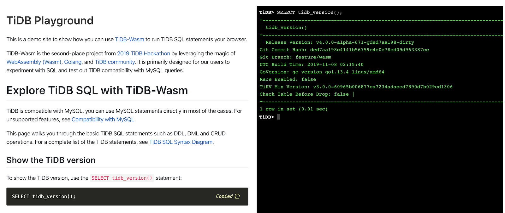
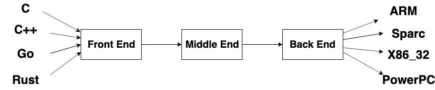
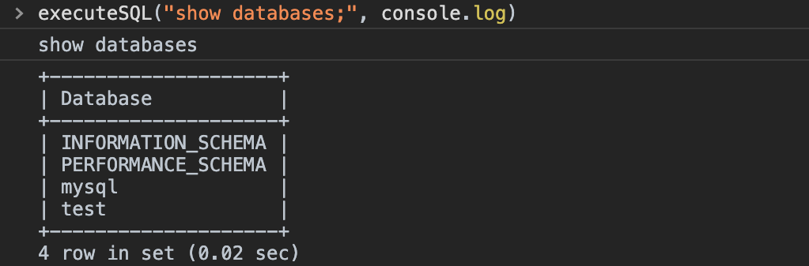

# TiDB-Wasm 原理と実現

クイックスタート：[https://play.pingcap.com/](https://play.pingcap.com/)



## WebAssembly の概要

読者に`WebAssembly`大体理解ために、先ずはこの技術の基本的な紹介である。

`WebAssembly`の[公式紹介](https://webassembly.org/)はこちら。

`WebAssembly`（以下略記`Wasm`）は、スタックベースの仮想マシン用のバイナリ命令形式であり、 `Wasm`は、`C`、`C++`、`Rust`などの高レベル言語のコンパイル用のポータブルターゲットとして設計されており、クライアントおよびサーバー上のアプリケーション用に`Web`上に展開できます。

言い換えれば、以下の結論で。

- `Wasm`は実行ファイルです。

- `C`、`C++`、`Rust`などの高レベル言語のプログラムを`Wasm`にコンパイルできます。

- `Wasm`はブラウザに実行できます。

### 実行の命令形式

以上の三つの結論見てとうり、質問があるかもしれます、命令形式は何ですか？一般的な[`ELFファイル`](https://ja.wikipedia.org/wiki/Executable_and_Linkable_Format)は`Unix`システムの共通の実行バイナリ命令形式、ローダーによって解析され、メモリにはいります、そして実行です。`Wasm`も同様、対応のランタイムを解析および実行である。現在、主流のブラウザー、[Node.js](https://nodejs.org/)、および`Wasmer`と呼ばれる`Wasm`専用に設計された一般的なランタイムです。さらに一歩進む、`Wasm`作成したプログラムをカーネルモードで簡単に実行できるために、`Wasm`ランタイムをカーネルに統合する機能を`Linux`カーネルに提供する人もいます。

主要なブラウザの[`Wasm`サポート](https://developer.mozilla.org/ja/docs/WebAssembly)：


### 高レベル言語から`Wasm`まで

上記の背景知識があれば、高レベル言語がどのように`Wasm`にコンパイルされる方は理解できます。まず、高水準言語のコンパイルプロセスを見てください。



アセンブリと比較して、高レベル言語の特徴の1つは移植性です。例えば、`C`と`C++`は`x86`マシンのターゲットにコンパイルできます、および`ARM`のマシンのターゲット。`Wasm`と`ARM`、`x86`は実際には同じ種類のものであり、バイトコードの実行をサポートする仮想マシンと考えることができます。これは`Java`に非常に似ていますが、実際には、`C`と`C++`は`JVM`にコンパイルおよび実行できます。

### さまざまなランタイムと`WASI`

以上は`Wasm`のデザインの目標はプログラムに`web`上に実行です。実際、`Wasm`の元々デザインのターゲットは`JavaScript`の実行効率を補うためください。開発が進むにつれて、この技術は仮想マシンとして扱う、そしてプログラムに移植するはまた、良いアイデアである。そのため、`NodeJS`の実行環境、`Wasmer`の実行環境、さらにはカーネル環境もあります。それから質問が来ます、こんあ沢山の実行環境であり、しかも各環境のインターフェースは違います、例えば、`NodeJS`はファイルシステムのインターフェースはできます、ブラウザはこのインターフェースはできまさん。`Wasm`の移植性に対処するには、[`WASI(WebAssembly System Interface)`](https://github.com/WebAssembly/WASI)が生まれました。`WASI`は低レベルの標準のインターフェースを定義します、コンパイラとWasmランタイム環境がこの標準をサポートしている限り、生成された`Wasm`はさまざまな環境にに移植できます。`Wasm`ランタイムは仮想マシンに相当し、`Wasm`はこのマシンの実行可能プログラムであり、`WASI`はこのマシンで実行されているシステムであり、そして`Wasm`の基礎的なインターフェースを提供します、例えばファイルシステムおよびソケットなど。

`Wasm`と`WASI`が何であるかをより良く説明するために、Hello Worldを使用して説明します、[デモソース](https://talks.godoc.org/github.com/chai2010/awesome-go-zh/chai2010/chai2010-golang-wasm.slide#27)。

```lisp
(module
    ;; type iov struct { iov_base, iov_len int32 }
    ;; func fd_write(id *iov, iovs_len int32, nwritten *int32) (written int32)
    (import "wasi_unstable" "fd_write" (func $fd_write (param i32 i32 i32 i32) (result i32)))

    (memory 1)(export "memory" (memory 0))

    ;; The first 8 bytes are reserved for the iov array, starting with address 8
    (data (i32.const 8) "hello world\n")

    ;; _start is similar to main function, will be executed automatically
    (func $main (export "_start")
        (i32.store (i32.const 0) (i32.const 8))  ;; iov.iov_base - The string address is 8
        (i32.store (i32.const 4) (i32.const 12)) ;; iov.iov_len  - String length

        (call $fd_write
            (i32.const 1)  ;; 1 is stdout
            (i32.const 0)  ;; *iovs - The first 8 bytes are reserved for the iov array
            (i32.const 1)  ;; len(iovs) - Only 1 string
            (i32.const 20) ;; nwritten - Pointer, inside is the length of the data to be written
        )
        drop ;; Ignore return value
    )
)
```

特定の命令の説明は、[命令セット](https://pengowray.github.io/wasm-ops/)を参照できます。

こちらの`hello.wat`は`Wasm`のテキストコードです、`wat`と`Wasm`の関係は、アセンブリと`ELF`の関係に似ています。次に、`wat`を`Wasm`にコンパイルし、`Wasmer`（一般的な`Wasm`ランタイム実装）を使用して実行します。

先ずは依存関係をインストールする。

- [Wasmer](https://github.com/wasmerio/wasmer)

- [wabt](https://github.com/WebAssembly/wabt)

そしてコンパイルおよび実行。

```sh
~ » wat2wasm hello.wat -o hello.wasm
~ » wasmer run hello.wasm
hello world
```

## TiDB の改修

未知は恐怖の源です、`Wasm`の原理を知っているなら、`TiDB`をブラウザに移動できます。

### ブラウザのセキュリティポリシー

よく知られている、ブラウザは本質的にサンドボックスです、内部のプログラムは危険のアクションは許可されていません、例えばポートをリスニングおよびファイルシステム。しかし、`TiDB`は使用の方がポートをリスニング、そしてユーザーは`MySQL`クライアントを使用して接続できます。そのために、`TiDB`はポートのをリスニングは必要であり。少し考えて、ポートをリスニングの限界突破、そして`MySQL`クライアントを使用して接続のことはいいじゃないは理解するできます。理想的な方法は`MySQL`クライアントのターミナルがウェブページの中にある、そしてこのクライアントは`TiDB`は接続されています。

先ずは、`TiDB`はターミナルを統合するのことは考えて。ユーザー入力`SQL`を受け入れ、そして出力は`SQL`の実行結果です。この`TiDB`のエグゼクティブターミナルを実装するのは難しい、ショートカットを考えました、`TiDB`のテストコードを使用してターミナルを後付けすることを計画。これはテストコードで見つかったスニペットです。

```go
result = tk.MustQuery("select count(*) from t group by d order by c")
result.Check(testkit.Rows("3", "2", "2"))
```

`tk`という名前のこのオブジェクトは、`SQL`ターミナルとして使用できます。これは`tk`の主な関数。

```go
// Exec executes a sql statement.
func (tk *TestKit) Exec(sql string, args ...interface{}) (sqlexec.RecordSet, error) {
	var err error
	if tk.Se == nil {
		tk.Se, err = session.CreateSession4Test(tk.store)
		tk.c.Assert(err, check.IsNil)
		id := atomic.AddUint64(&connectionID, 1)
		tk.Se.SetConnectionID(id)
	}
	ctx := context.Background()
	if len(args) == 0 {
		var rss []sqlexec.RecordSet
		rss, err = tk.Se.Execute(ctx, sql)
		if err == nil && len(rss) > 0 {
			return rss[0], nil
		}
		return nil, errors.Trace(err)
	}
	stmtID, _, _, err := tk.Se.PrepareStmt(sql)
	if err != nil {
		return nil, errors.Trace(err)
	}
	params := make([]types.Datum, len(args))
	for i := 0; i < len(params); i++ {
		params[i] = types.NewDatum(args[i])
	}
	rs, err := tk.Se.ExecutePreparedStmt(ctx, stmtID, params)
	if err != nil {
		return nil, errors.Trace(err)
	}
	err = tk.Se.DropPreparedStmt(stmtID)
	if err != nil {
		return nil, errors.Trace(err)
	}
	return rs, nil
}
```

後では簡単です、Read-Eval-Print-Loop（REPL）プログラムを作成してユーザー入力を読み取り、入力を上記の`Exec`関数に渡し、`Exec`関数の出力を標準出力にフォーマットしてから、ループでユーザー入力の読み取りを続けます。

### コンパイルの問題

ターミナルの統合は最初の手順です、次には重要な質問を検証する必要があります。`TiDB`を`Wasm`のターゲットにコンパイルできますか？`TiDB`は`Golang`で製されていますが、しかし、参照されたライブラリは、プラットフォーム固有のコードを直接コンパイルできない場合があります。[公式の`Golang`ドキュメント](https://github.com/golang/go/wiki/WebAssembly#getting-started)に従ってコンパイルはできません。

```sh
~/go/src/github.com/pingcap/tidb(master*) » GOOS=js GOARCH=wasm go build -o bin/tidb.wasm tidb-server/main.go
build command-line-arguments: cannot load github.com/pingcap/tidb/util/signal: no Go source files

~/go/src/github.com/pingcap/tidb(master*) » ls util/signal
signal_posix.go  signal_windows.go
```

`signal`関連の関数に`Wasm`プラットフォームの実装がないため、コンパイルに失敗しました。ネコをマネてトラを描くのことのように、`signal wasm.go`を実装する。

```go
package signal

// SetupSignalHandler setup signal handler for TiDB Server
func SetupSignalHandler(shutdownFunc func(bool)) {
}
```

そして、コンパイルを再開する。

```sh
~/go/src/github.com/pingcap/tidb(master*) » GOOS=js GOARCH=wasm go build -o bin/tidb.wasm tidb-server/main.go
# github.com/coreos/go-systemd/journal
../../../../pkg/mod/github.com/coreos/go-systemd@v0.0.0-20181031085051-9002847aa142/journal/journal.go:99:13: undefined: syscall.UnixRights
# github.com/pingcap/goleveldb/leveldb/storage
../../../../pkg/mod/github.com/pingcap/goleveldb@v0.0.0-20171020122428-b9ff6c35079e/leveldb/storage/file_storage.go:81:16: undefined: newFileLock
../../../../pkg/mod/github.com/pingcap/goleveldb@v0.0.0-20171020122428-b9ff6c35079e/leveldb/storage/file_storage.go:166:3: undefined: rename
../../../../pkg/mod/github.com/pingcap/goleveldb@v0.0.0-20171020122428-b9ff6c35079e/leveldb/storage/file_storage.go:252:11: undefined: rename
../../../../pkg/mod/github.com/pingcap/goleveldb@v0.0.0-20171020122428-b9ff6c35079e/leveldb/storage/file_storage.go:257:11: undefined: syncDir
../../../../pkg/mod/github.com/pingcap/goleveldb@v0.0.0-20171020122428-b9ff6c35079e/leveldb/storage/file_storage.go:354:14: undefined: rename
../../../../pkg/mod/github.com/pingcap/goleveldb@v0.0.0-20171020122428-b9ff6c35079e/leveldb/storage/file_storage.go:483:9: undefined: rename
../../../../pkg/mod/github.com/pingcap/goleveldb@v0.0.0-20171020122428-b9ff6c35079e/leveldb/storage/file_storage.go:519:13: undefined: syncDir
# github.com/remyoudompheng/bigfft
../../../../pkg/mod/github.com/remyoudompheng/bigfft@v0.0.0-20190512091148-babf20351dd7/arith_decl.go:10:6: missing function body
../../../../pkg/mod/github.com/remyoudompheng/bigfft@v0.0.0-20190512091148-babf20351dd7/arith_decl.go:11:6: missing function body
../../../../pkg/mod/github.com/remyoudompheng/bigfft@v0.0.0-20190512091148-babf20351dd7/arith_decl.go:12:6: missing function body
../../../../pkg/mod/github.com/remyoudompheng/bigfft@v0.0.0-20190512091148-babf20351dd7/arith_decl.go:13:6: missing function body
../../../../pkg/mod/github.com/remyoudompheng/bigfft@v0.0.0-20190512091148-babf20351dd7/arith_decl.go:14:6: missing function body
../../../../pkg/mod/github.com/remyoudompheng/bigfft@v0.0.0-20190512091148-babf20351dd7/arith_decl.go:15:6: missing function body
../../../../pkg/mod/github.com/remyoudompheng/bigfft@v0.0.0-20190512091148-babf20351dd7/arith_decl.go:16:6: missing function body
```

これは同じ問題だ、偽物の実装を使用する、コンパイルは可能です。

```go
package storage

import (
	"os"
	"syscall"
)

func newFileLock(path string, readOnly bool) (fl fileLock, err error) {
	return nil, syscall.ENOTSUP
}

func setFileLock(f *os.File, readOnly, lock bool) error {
	return syscall.ENOTSUP
}

func rename(oldpath, newpath string) error {
	return syscall.ENOTSUP
}

func isErrInvalid(err error) bool {
	return false
}

func syncDir(name string) error {
	return syscall.ENOTSUP
}
```

同じ方法を使用して`arith_decl`の問題を解決はできません、`missing function body`エラーとは何ですか？`arith_decl.go`のディレクトリは見てとうり、何が起こったのかがわかります。

```sh
~ » ls ~/go/pkg/mod/github.com/remyoudompheng/bigfft@v0.0.0-20190512091148-babf20351dd7
arith_386.s    arith_arm64.s  arith_decl.go    arith_mipsx.s  calibrate_test.go  fermat_test.go  fft_test.go  LICENSE  scan.go
arith_amd64.s  arith_arm.s    arith_mips64x.s  benchmarks     fermat.go          fft.go          go.mod       README   scan_test.go
```

`arith_decl.go`は関数の宣言であり、関数の特定の実装は、各プラットフォームに関連するなアセンブリファイルにあります。

対応の関数は実装、問題は解除できる、そう考えるのは簡単すぎる。この`bigfft`はライブラリです、だからそちのコードの編集は簡単な作業ではありません。`TiDB`はこのライブラリに直接依存せず、代わりに`mathutil`に依存し、`mathutil`lはこの`bigfft`に依存します。

`TiDB`は、`mathutil`のライブラリが提供する関数を使用します、理想的な対策はデフォルトでこれら2つのライブラリを使用する、`Wasm`のコンパイル時には使用されません。そのために、`util/mathutil`パッケージを作成する、中にリ`mathutil_linux.go`と`mathutil_js.go`を入れて。元々参照されていた関数を`mathutil_linux.go`に再輸出します、これらの関数は`mathutil_js.go`に再実装されます。これから、`Wasm`のターゲットをコンパイルの時はオリジナルの`mathutil`ライブラリを使用しません。

```sh
~/go/src/github.com/pingcap/tidb(feature/wasm) » GOOS=js GOARCH=wasm go build -o bin/tidb.wasm tidb-server/main.go
~/go/src/github.com/pingcap/tidb(feature/wasm) » ls -l bin
total 85816
-rwxrwxr-x 1 coder coder 87868180 Dec 14 18:16 tidb.wasm
```

成功しました！

### 互換性の問題

コンパイル出したの`tidb.wasm`は`os.Stdin`を介して入力した`SQL`を読み取り、`os.Stdout`を介して結果を出力します。だから、ウェブページはまだブランクした。ただし、`TiDB`のログは`os.Stdout`に送られるため、ブラウザコンソールで`TiDB`の通常の起動のログを確認する必要があります。しかし、残念ながら例外のスタックトレースが表示されます。


このエラーが発生するの理由は`os.Stat`は実装しない。現在、`Golang`は`WASI`のサポートはあまり良くない、`wasm_exec.js`で`fs`を部分的に実装しています：

```js
global.fs = {
  writeSync(fd, buf) {
    ...
  },
  write(fd, buf, offset, length, position, callback) {
    ...
  },
  open(path, flags, mode, callback) {
    ...
  },
  ...
}
```

この`fs`の実装は`stat`、`lstat`、`unlink`、`mkdir`などの呼び出しを実装しません。幸いなことに、`JavaScript`は動的プログラミング言語です、関数を`fs`に動的に追加できます。

```js
function unimplemented() {
  const err = new Error('not implemented');
  err.code = 'ENOSYS';
  arguments[arguments.length - 1](err)
}

fs.stat = unimplemented;
fs.lstat = unimplemented;
fs.unlink = unimplemented;
fs.rmdir = unimplemented;
fs.mkdir = unimplemented;
go.run(result.instance);
```

ウェブページを再読み込み、起動ログがコンソールに表示されました！


これまで、`TiDB`を`Wasm`にコンパイルするの技術的な問題はすべて解決されました。後では、以前に作成されたの`REPL`ターミナルを置き換える適切なターミナルを見つけることなら、ページに`SQL`を入力してのことはできます。

### ユーザーインターフェース

上記の仕事により、`SQL`を受け入れてその実行結果を出力する`Exec`関数ができました。ブラウザで実行するには、この関数とインタラクションするためのブラウザバージョンの`SQL`ターミナルも必要です。その対策は`window`に`Exec`関数を登録する、なら`JavaScript`の関数は`Exec`呼び出すことはできます。

```go
js.Global().Set("executeSQL", js.FuncOf(func(this js.Value, args []js.Value) interface{} {
	go func() {
		// Simplified code
		sql := args[0].String()
		args[1].Invoke(k.Exec(sql))
	}()
	return nil
}))
```

それで、コンソールの場合は`SQL`を実行できます。



`jquery.console.js`を使用して`SQL`ターミナルを構築し、`executeSQL`をコールバックとして渡します。完了します！


### ローカルファイルアクセス

`TiDB`には、ローカルファイルシステムにアクセスする必要があるいくつかの関数があります、例えば[`LOAD DATA`](https://pingcap.com/docs/stable/reference/sql/statements/load-data/)および`LOAD STATS`。`LOAD DATA`の機能は、ローカルファイルからデータベースにデータをインポートする。交換方法はブラウザのファイルアップロードウィンドウを使用した、`LOAD STATS`の実装は同じです。

```go
js.Global().Get("upload").Invoke(js.FuncOf(func(this js.Value, args []js.Value) interface{} {
go func() {
	fileContent := args[0].String()
		_, e := doSomething(fileContent)
			c <- e
	}()
	return nil
}), js.FuncOf(func(this js.Value, args []js.Value) interface{} {
	go func() {
		c <- errors.New(args[0].String())
	}()
	return nil
}))
```

`SOURCE`コマンドはローカルファイルを読み取り、まとは`MySQL`クライアントで実行します。`TiDB`を初めて使用するユーザーは、`TiDB`と`MySQL`の互換性を確認したいと考えています。このコマンドは、ユーザーがテストデータをすば速いインポートするのに役立ちます。

`SOURCE`コマンドの効果を示す例として`test.sql`ファイルを取り上げます`test.sql`ファイルの内容は下記です。

```sql
CREATE DATABASE IF NOT EXISTS samp_db;

USE samp_db;

CREATE TABLE IF NOT EXISTS person (
  number INT(11),
  name VARCHAR(255),
  birthday DATE
);

CREATE INDEX person_num ON person (number);

INSERT INTO person VALUES("1","tom","20170912");

UPDATE person SET birthday='20171010' WHERE name='tom';
```

`SOURCE`コマンドを入力すると、ファイル選択ボックスがポップアップします。


選択後、`SQL`が自動的に実行され、`TiDB`のテストを続行できます。


## まとめと展望

TiDBを移植するために、主にいくつかの問題を解決しました。

- ブラウザはポートをリスニングのことはできません。`SQL`ターミナルを`TiDB`に埋め込みました。

- `goleveldb`の`Wasm`コンパイル。

- `bigfft`の`Wasm`コンパイル。

- `Golang`は`WASI`のサポートが不完全なため、`fs`関連の機能がありません。

- `TiDB`はローカルファイルの読み込みをブラウザのアップロードファイルの読み込みに変換します。

- `SQL`をバッチで実行する`SOURCE`コマンドをサポート。

現在`PingCAP`は、このプロジェクトを[TiDB Playground](https://play.pingcap.com/)および[TiDB Tour](https://tour.pingcap.com/)のユーザーが利用できるようにしました。ユーザーはインストールと構成を行う必要がないため、ユーザーはドキュメントを読みながら試してみることができます。これにより、ユーザーが`TiDB`は使用して学ぶ安いです。コミュニティにはすでに`TiDB Wasm`に基づくデータベースチュートリアルがあります[tidb-wasm-markdown](https://github.com/imiskolee/tidb-wasm-markdown)。

このプロジェクトは`PingCAP Hackathon`で二等賞を受賞しました。スケジュールが厳しいため、まだたくさんの機能は実装されていません、例えば：

- `IndexedDB`を使用したデータの永続化：`IndexedDB`のストレージインターフェイスのセットを実装する。

- `P2P`を使用した他のブラウザーにサービスを提供する：将来、ますます多くのアプリケーションが`Wasm`に移行されるでしょう、多くのデータベースが必要、`TiDB Wasm`を使用できます。

- `TiDB Wasm`のバイナリスリミング：現在のはほぼ`80MB`、読み込みが遅い、実行時によりたくさんのメモリを使用する、これらは最適化する必要があります。

興味のあるコミュニティの友人は、このプロジェクトに参加して一緒に楽しんでください、[プロジェクト](https://github.com/pingcap/tidb/projects/27)、[info@pingcap.com](mailto:info@pingcap.com)でお問い合わせいただくこともできます。
